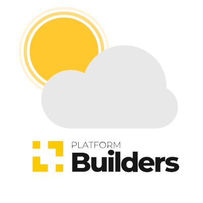

<div align="center" >
  
</div>
<h1 align="center" >
    Builder Weather App
</h1>

<h4 align="center">
  Hora de verificar os dados climático de sua região!
</h4>
<div align="center" >
  
  
</div>
<br/>

## :large_blue_diamond: Descrição

O **Builder Weather** é um aplicativo que busca, a partir da sua localização, o seu endereço, consultando na API de mapas do Google e os dados climáticos da sua região consultando a API do Open Weather Map. Após mostrar todos os dados numa interface amigável e minimalista, a aplicação dá a opção de atualizar os dados.

Você pode baixar o aplicativo para instalação no Android clicando [aqui](https://expo.io/artifacts/1fe3c09e-e132-40f7-b35b-d459d0418979)

<br/>

## :large_blue_diamond: Motivação

Esta aplicação é um teste para a [Platform Builders](https://platformbuilders.io/) e buscou-se, além de entregar as funcionalidades requeridas, entregar um software com:

- **uma excelente arquitetura:** boas práticas, clean architecture, TDD e utilização de patterns como SOLID;
- **uma excelente interface:** design de UI minimalista, amigável, com animações, transações de componentes, cores vivas...;
- **uma documentação** de explicação do software, bem como os testes unitários.

<br/>

## :large_blue_diamond: Um pouco da Arquitetura

Para este projeto, levando em conta o aspecto que seria valorizado, foi escolhido um padrão de arquitetura seguindo os princípios da _Clean Architecture_ pensando no desacoplamento de camadas, manutenibilidade e escalabilidade de um projeto. Além disso, foi pensado para utilizar um padrão orientado a objetos em algumas camadas mais lógicas e de negócio e na camada da interface, onde temos o React e React Native, utilizou-se a linguagem funcional e reativa com hooks e Context API.

As camadas ficaram assim:

- **Domain:** contém os tipos de entidades da aplicação Location, Address e Forecast e possui as interfaces de serviços. Temos: o HttpGetlClientI, RemoteAddressI e RemoteForecastI que são os protocolos que serão implementados nas classes. Temos também aqui os erros da aplicação. Para a versão 1.0.0 apenas uma classe de erro foi criada, mas da forma que foi implementado é muito fácil de adicionar, aplicando o Open Closed Principle;

- **Data:** Nesta camada implementamos os casos de uso da aplicação que são GoogleRemoteAddress e OpenWeatherRemoteForecast que buscam respectivamente o endereço e dados climáticos. Em seus métodos construtores recebem as dependências necessárias (Dependency Inversion Principle) e entendem apenas de seu serviço (Single Responsability Principle);

- **Infra:** É a camada de mais baixo nível e ela contém a implementação da classe que se comunica com o Axios, isto é, é a única camada que temos que contém este serviço o que diminui o acoplamento e dependência de uma biblioteca externa, sendo fácil para manter. No projeto temos o AxiosGetClient que implementa a interface HttpGetClientI;

- **Screens:** essa é a camada de apresentação, de UI, onde temos o código JSX do que será a renderização da tela da aplicação. Para esta camada, há muitos diretórios fornecendo recursos como: componentes menores, estilos e assets;

- **Main ou Controller:** Para unir a tela com toda a lógica de negócio temos a camada main ou controller. No projeto, esta camada é um custom hook que basicamente carrega toda a aplicação istanciando os objetos e invocando as funções para buscar os dados assíncronos e entregar para a tela, utilizando um provider Context API para prover essas informações. O carregamento consiste em: verificar permissão de localização do dispositivo, buscar localização, buscar endereço e buscar dados climáticos, passando os dados prontos para a apresentação. Essa composição faz com que apenas essa camadas fique responsável por controlar a aplicação.

Essas duas últimas camadas utilizam o React e React Native e são escritas com programação funcional e reativa.

### Outras implementações

O projeto poderia ser implementado somente com a camada de apresentação, o hook de carregamento principal e uma camada de serviços com o axios (ou fetch) para buscar os dados. Essa solução é mais comum e tem aspectos positivos e negativos, mas vou deixar isso para um próximo contato. Nesta abordagem citada podemos perceber algo como o padrão MVC.

O interessante disso é que podemos manter a mesma camada para apresentação, já que ela está desacoplada das regras. A camada main, nosso hook principal, também é facilmente modificada.

<br/>

## :large_blue_diamond: Interface

A interface foi idealizada para ser clean e leve e possui as seguintes características:

- Gradiente no background e utilização de cores vivas. O background da aplicação muda de acordo com o dia e a noite, dependendo da resposta climática da API Open Weather Map;
- Organização de dados: os dados são colocados em tela seguindo boas práticas de espaçamento, agrupamento e tamanho de tipografia;
- Iconografia: ícones que proporcionam mais leveza à interface em geral;
- Elementos visuais com opacidade: dão um aspecto mais clean e leve à interface em geral;
- Animações de transição: além de deixar mais agradável a usabilidade, traz fluidez e leveza;
- Animação Lottie: deixar mais agradável a interface;
- Responsividade: boas práticas para layout ajustar em diversos devices;

<br/>

## :large_blue_diamond: Documentação

Para a documentação do software temos os seguintes artefatos:

- Testes de software: embora não seja BDD testes é uma boa forma de testar;
- Este README: documento explicativo sobre o projeto;
- Artefato apk instalável para Android.(Disponível [aqui](https://expo.io/artifacts/1fe3c09e-e132-40f7-b35b-d459d0418979))

> <i>Importante:</i> Testes de interface serão realizados nas próximas entregas

<br/>

## :large_blue_diamond: Sobre as tecnologias

O projeto foi desenvolvida utilizando as seguintes tecnologias:

- [React](https://pt-br.reactjs.org/), [React Native](https://reactnative.dev/) com [Typescript](https://www.typescriptlang.org/): Principais tecnologias do projeto;
- [Expo](https://docs.expo.io/): pela agilidade e facilidade de entrega de um artefato instalável, para facilmente poder ser compartilhado e por alguns recursos de seu CLI;
- [Styled-components](https://styled-components.com/docs): pela facilidade e experiência para a estilização dos componentes;
- [Lottie-react-native](https://github.com/lottie-react-native/lottie-react-native): para utilizar as animações [Lottie](https://lottiefiles.com/);
- [Axios](https://github.com/axios/axios): para fazer as requisições http.

<br/>

## :large_blue_diamond: Serviços utilizados

Os serviços utilizados neste projeto foram:

- Geocoding API da Google Clould Platform: para retornar dados do endereço a partir de uma localização;
- Open Weather Map API: para retornar os dados climáticos.

> <i>Nota:</i> foi mantida uma chave dos serviços na aplicação para a avaliação!
> Essas chaves são privadas e será retidada do projeto em breve sendo configuráveis como variáveis ambiente

<br/>

## :large_blue_diamond: Download do aplicativo

Você pode baixar o aplicativo para instalação no Android clicando [aqui](https://expo.io/artifacts/1fe3c09e-e132-40f7-b35b-d459d0418979)

Pode visualizar a página do app na Expo clicando [aqui](https://expo.io/@agnaldoburgojr/projects/weather-app)

<br/>

## :large_blue_diamond: Rodando a aplicação

Para rodar a aplicação tenha o [npm](https://www.npmjs.com/get-npm) e [Yarn](https://yarnpkg.com/getting-started) rodando em sua máquina. Siga os seguintes passos:

```bash
# Install expo
$ sudo npm install --global expo-cli

# Clone this repository
$ git clone https://github.com/agnaldoburgojr/weather-app.git weatherApp

# Go into the repository
$ cd weatherApp

# Install the dependences
$ yarn install

# Run the app
$ expo start

```

Em um dispositivo, baixe na AppStore (para IOS) ou PlayStore (Android) o aplicativo Expo. Este é o client para rodar o simulador em seu dispositivo.

Abra o aplicativo e scaneie o QRCode que está em seu terminal (após rodar o `expo start`)

### Testes

Para rodar os testes use o comando abaixo dentro do diretório do projeto

```
yarn test --verbose
```

<br/>

## :large_blue_diamond: Próximas features

Para os próximos passos temos as seguintes issues:

- Mudar a tipografia;
- Testes de interface;
- Adicionar mais classes de erros para a aplicação.

<br/>

## :large_blue_diamond: Contato

Fico a disposição para explicação e dúvidas sobre o projeto.

- **Email:** agnaldoburgojr@gmail.com
- **Cel:** (14) 99625-7952

## :large_blue_diamond: Licença

Este projeto possui Licença MIT. Olhe [LICENSE](https://github.com/agnaldoburgojr/weather-app/blob/master/LICENCE) para mais informações.

<br/>

---

Feito com ♥ por Agnaldo Burgo Junior :wave: [Get in touch!](https://www.linkedin.com/in/agnaldo-burgo-junior/)
